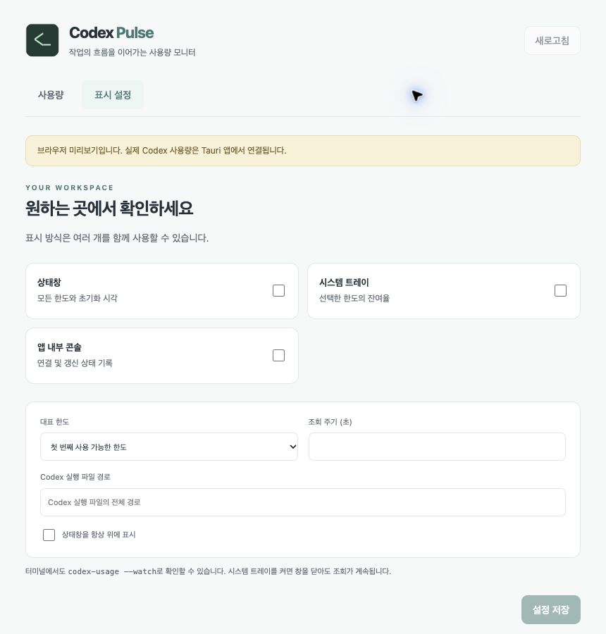

# Codex Pulse

**Keep your coding flow in view.**

Codex의 잔여 한도와 초기화 시각을 한눈에 보여주는 Rust + Tauri 데스크톱 앱입니다. macOS·Linux·Windows용 패키징과 GitHub 자동 검증을 구성합니다. by **nanamix**.

[릴리스 다운로드](https://github.com/nanamix/codex-pulse/releases) · [플랫폼 검사](https://github.com/nanamix/codex-pulse/actions/workflows/ci.yml)



계정 데이터 없는 브라우저 설정 미리보기입니다. 실제 사용량은 네이티브 앱에서 확인합니다.

## 주요 기능

- 대표 한도의 잔여율을 큰 숫자로 표시하고, 서버가 제공한 기간과 초기화 시각을 함께 확인합니다.
- 여러 한도, 초기화 크레딧의 잔여 횟수와 사용기한, 제공되는 토큰 요약을 표시합니다.
- 시스템 트레이에서 상태창 열기, 새로고침, 종료를 실행합니다. macOS 메뉴바에는 대표 잔여율도 표시됩니다.
- 밝은/어두운 테마, 작은 창, 항상 위 표시, 조회 주기 설정을 지원합니다.
- 지원 macOS 기기의 Touch Bar와 터미널 CLI를 함께 사용할 수 있습니다.
- 조회 실패 시 이전 데이터를 오래된 값으로 표시하며, 정보가 없으면 0으로 표시하지 않습니다.

## 설치와 플랫폼

먼저 사용할 OS에 Codex CLI를 설치하고 터미널에서 `codex login`을 실행하세요. 앱은 현재 기기의 CLI 로그인 상태를 사용합니다. 별도 API 키 입력은 필요하지 않습니다.

| 운영체제 | 릴리스 대상 | 필요 조건 |
|---|---|---|
| macOS | Apple Silicon / Intel DMG | macOS 12 이상, Codex CLI |
| Linux | x64 AppImage / Debian 패키지 | WebKitGTK 4.1, Codex CLI. AppImage는 환경에 따라 FUSE 필요 |
| Windows | x64 NSIS 설치 프로그램 | Windows 10/11, WebView2, native Codex CLI |

릴리스는 모든 플랫폼 빌드가 성공한 후 공개됩니다. 표는 패키징 대상이며 실제 실행 검증 결과는 릴리스 노트와 Actions 결과를 확인하세요. Linux 트레이 표시는 데스크톱 환경의 AppIndicator 지원에 따라 다릅니다. Windows/Linux 트레이의 잔여율은 툴팁과 상태창에서 확인합니다.

macOS는 개발용 ad-hoc 서명이며 Apple 공증은 구성하지 않았습니다. Windows 배포 서명도 구성하지 않았습니다. 설치 시 OS의 보안 검증 대상이 될 수 있습니다.

Windows에서는 `codex.cmd`가 아닌 native `codex.exe`를 실행합니다. PATH, 사용자 설치 디렉터리, npm의 기본 전역 설치 패키지 위치를 탐색합니다. 사용자 정의 npm/pnpm 설치는 표시 설정에서 실제 `codex.exe`의 전체 경로를 지정하세요. WSL 안의 CLI 인증과 Windows native CLI 인증은 별개의 환경입니다.

기존 Codex Usage Monitor 사용자의 설정을 유지하도록 앱 식별자는 `com.nanamix.codex-usage-monitor`를 유지합니다. 설정은 운영체제별 앱 데이터 디렉터리의 `settings.json`에 저장됩니다. 기존 앱과 Pulse를 동시에 실행하지 마세요.

## 개발

Rust, Node.js 24.3 이상, 운영체제별 [Tauri 2 개발 도구](https://v2.tauri.app/start/prerequisites/)가 필요합니다. macOS는 Xcode Command Line Tools, Windows는 MSVC C++ Build Tools, Linux는 아래 패키지가 필요합니다.

```sh
# Ubuntu / Debian
sudo apt-get install libwebkit2gtk-4.1-dev build-essential libxdo-dev libssl-dev librsvg2-dev libayatana-appindicator3-dev

npm ci
npm run tauri dev
```

패키징:

```sh
npm run tauri build -- --bundles app,dmg    # macOS
npm run tauri build -- --bundles deb,appimage # Linux
npm run tauri build -- --bundles nsis       # Windows
```

macOS 앱만 생성할 때는 `--bundles app`을 사용합니다. 결과는 `target/release/bundle/`에 생성됩니다.

검사:

```sh
npm test
npm run build
cargo fmt --all -- --check
cargo build -p usage-test-server
cargo test --workspace --locked
cargo clippy --workspace --all-targets --locked -- -D warnings
```

테스트 서버는 Rust로 작성된 로컬 stdio peer이며 실제 계정이나 네트워크를 사용하지 않습니다. 주요 CLI·JSON-RPC·모니터 검사와 설정 저장 검사는 모든 플랫폼에서 실행합니다. 셸 래퍼를 사용하는 고급 타임아웃·계정 전환 테스트는 Unix 환경에서 실행합니다.

`npm run dev`는 계정 데이터 없는 브라우저 화면을 `127.0.0.1:1420`에 제공합니다. `npm run preview`는 `dist/preview.html` 단일 파일 미리보기를 생성합니다. 실제 계정 사용량은 네이티브 앱에서 확인합니다.

## 터미널 사용

```sh
cargo run -p usage-cli -- --watch
cargo run -p usage-cli -- --json
cargo run -p usage-cli -- --watch --json --interval 30
cargo run -p usage-cli -- --codex-path /path/to/codex
```

Windows 경로는 native `codex.exe`를 지정하세요. `--json` 일회 모드는 JSON 객체 하나를, 연속 모드는 한 줄에 하나씩 출력합니다. 조회 실패는 종료 코드 1, 잘못된 인자는 2입니다.

## 데이터 처리

`codex app-server --listen stdio://`와 JSON-RPC로 사용 한도를 조회합니다. `account/rateLimits/read`와 갱신 알림을 사용하고 주기적 조회를 함께 수행합니다. 기간을 5시간·주간으로 고정하지 않습니다. 기본 조회 주기는 30초이며 5–3600초를 지원합니다.

ChatGPT 사용 한도를 대상으로 하며 API 청구서를 집계하지 않습니다. `ordinaryUsageAllowed=false`는 수치와 별도로 표시합니다. 선택적 사용량 API가 지원되지 않아도 한도 조회는 유지합니다. 초기화 횟수는 서버의 `rateLimitResetCredits.availableCount`를 사용합니다.

앱은 인증 토큰, 계정 이메일, 프롬프트 및 Codex stderr 원문을 로그에 저장하지 않습니다. 모델 추론, 크레딧 초기화 요청을 보내지 않습니다. TypeSafe 스킬의 역할 분리 원칙에 따라 정확한 조회·계산·실행은 코드가 담당하며 이번 앱에는 TypeSafe 서비스 호출을 추가하지 않았습니다.

## 공개 배포

`main` 푸시는 세 운영체제의 검사 워크플로를 실행합니다. 앱 버전을 갱신한 뒤 `v<version>` 태그를 푸시하면 macOS 두 아키텍처, Linux x64, Windows x64 패키지를 draft release에 모으고 모든 빌드 성공 후 공개합니다.

## 구조

| 디렉터리 | 역할 |
|---|---|
| crates/usage-core | 모델, JSON-RPC, 조회·알림·재연결 |
| crates/usage-cli | 터미널 실행 파일 |
| crates/test-server | 테스트 전용 App Server peer |
| src-tauri | 네이티브 창·트레이·설정·Touch Bar |
| src | TypeScript UI |
| .github/workflows | 플랫폼 검사와 설치 패키지 배포 |

MIT License. Codex Pulse는 nanamix의 독립 프로젝트입니다.
